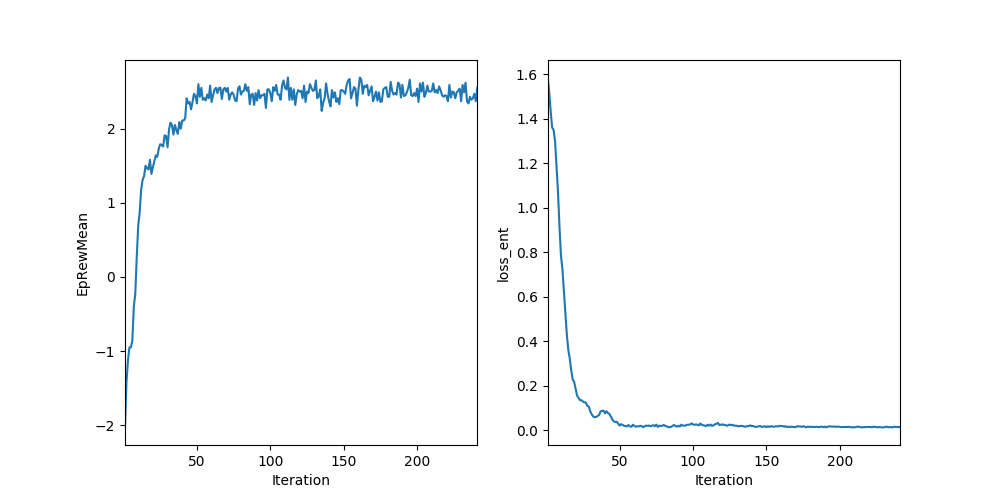
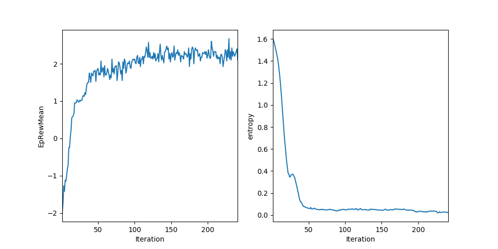
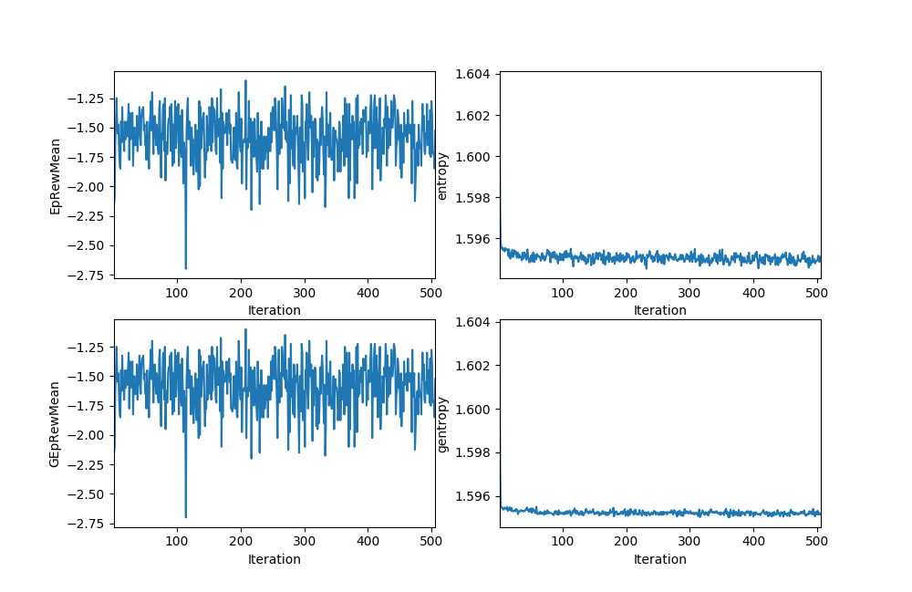

# Guided RL Approach

As mentioned previously, we want to improve the existed RL algorithems in POMDP environments by proposing a guided learning way. 

Be specific, we firstly generate sequences in MDP environment: [$O_1, A_1, Rwd_1, Done_1, Vpred_1$] with real states from Guided network, and then generate sequences in POMDP environment:[$O_2, A_2, Rwd_2, Done_2, Vpred_2$] with noisy sensor data from Learning network. 

Feed $O_2$ into Guided net, we could get $A_2'$, and feed $O_1$ into Learning net, we could get $A_1'$. 

TRPO and PPO are trying to solve the trust region problem by denoting the surrogain loss function as

\begin{equation*}
L(\theta)=E[\dfrac{\pi(a|s)}{\pi_{old}(a|s)}A]\\
s.t.:  D_{KL}(\pi_{old}||\pi)<\delta
\end{equation*}

Where $A_t = \delta_t+(\lambda\gamma)\delta_{t+1}+...+(\lambda\gamma)^{T-t+1}\delta_{T-1}$  and $\delta_t=r_t+\gamma V(s_{t+1})-V(s_t)$

Then we have 
\begin{equation*}
L(\theta_g)=E[\dfrac{\pi(a_2|s_2)}{\pi_{oldt}(a_2|s_2)}A_2],  L(\theta_t)=E[\dfrac{\pi(a_1|s_1)}{\pi_{oldg}(a_1|s_1)}A_1]
\end{equation*}

\begin{equation*}
D_{KLg}(\pi_{told}(.|O_2)||\pi_g(.|O_2))<\delta,  
D_{KLt}(\pi_{gold}(.|O_1)||\pi_t(.|O_1))<\delta
\end{equation*}

We have to calculate advantage by vpred (V), rwd, it is easily to see that we can use the reward directly form the sequences, but the predicted value could be considered as the following ways 

\begin{matrix}
O_1 & -> & V_{pred1} \\
O_2 & -> & V_{pred2}'
\end{matrix}
\begin{matrix}
O_1 & -> & V_{pred1}' \\
O_2 & -> & V_{pred2}
\end{matrix}

We Firstly try PPO and TRPO seperately in FieldVisionRockSample environment with mapsize: 5x7, observation type: field_vision_full_pos, observation noise: True, history steps:15. We ran each algorithm for 250 iterations and averaged the results over 10 runs.

PPO in FieldVisionRockSample

    

TRPO in FieldVisionRockSample

We can see that PPO could reach higher reward result compared with TRPO, but both of them converge prematurely in POMDP envrionment.

Since we have multiple choices for value networks, we firstly choose $V_{gnet} = O_2 -> V_{pred2}$, and $V_{tnet} = O1 -> V_{pred1}$ to calculate advantage.

We then test with the same settings as before, first is TRPO, we observed that it couldn't compute a good step for KL constraint, the reason coulde be that the  KL divergence is calculated by different policy distribution, and thus, is possibly too large sometimes. Then, we try the same settings for PPO and get the following results.

Guided TRPO in FieldVisionRockSample

    

Guided PPO in FieldVisionRockSample

We can see from the above image that this format of guided learning performs worse than PPO itself. The reason could be PPO clipped the surrogate loss into:

\begin{equation*}
L^{CLIP}(\theta)=E[min(r(\theta)A, clip(r(\theta), 1-\epsilon, 1+\epsilon)A)]\\
r(\theta) = \dfrac{\pi_{\theta}(a|s)}{\pi_{\theta old}(a|s)}
\end{equation*}
where epsilon is a hyperparameter, say, $\epsilon=0.2$

When we calculate surrogate loss with different policy distribution, the results could be far more than 1, and will be eventually clipped into $(1-\epsilon,1+\epsilon)$ 

Therefore, we have to try other combinations, $V_{gnet} = O_2 -> V_{pred2}'$, and $V_{tnet} = O_1 -> V_{pred1}'$ 

Guided PPO (v2) in FieldVisionRockSample

As we can see above, we got extremely small values sometimes when we update guided policy 
